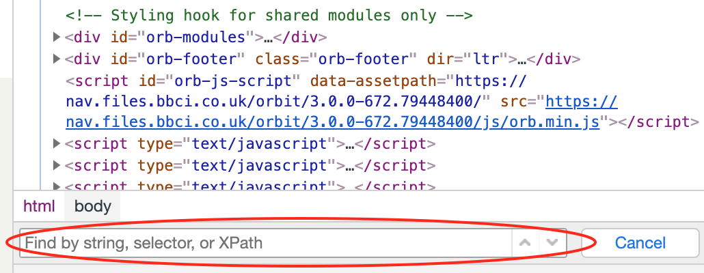

= Create Steps for Scenarios
:Author: Simon Stratton
:Version: 0.1
:source-highlighter: prettify

:doctype: book

:blank: pass:[ +]

. Start the app with the following command in the Terminal (within Visual Studio Code):

 npm start

Usually you will start by creating a link:../steps/navigation.steps.feature[navigation] step.

. Create the navigation step by copying an example one from the link:../steps/navigation.steps.feature[navigation] examples.
. Change the page name to the one you need. A list of page names can be found in the link:../libs/enums/src/lib/page-url.enum.ts[page-url.enum.ts] file.
+
NOTE: If your page doesn't already exist, please ask Mo or Arun to help
+
. Use the `debug` feature to navigate to the page.

====
*How to Use the `Debug` Feature?*

. Add the `@runThis` tag to your scenario in the Feature File.
. Hold down the `ctrl` key. This turns the step in the Feature File into a link. Click on the step.
. This will take you to the step function in the `Step Definition` file.
. Add the following keyword as the last line of code within the step function:
+ 
 debugger;
+
. Open the `Debug` screen on the left of Visual Studio Code by clicking on the Debug icon on the left. image:support/images/debug-icon.png[title=debugicon]
. Click on the `Play` button at the top of the `Debug` screen to run your test. image:support/images/debug-play.png[title=debugplay]

NOTE: Don't forget to ensure you're running the correct `Debug` configuration.

*Common Problems*

. `@runThis` tag may not be set in the link:.\protractor.debug.config.ts[protractor.debug.config.ts] file.

NOTE: use `ctrl + p` to search the Test Automation Framework for a particular file.

====

Once you've navigated to the page, Check the relevant steps files below:

. link:steps/data.steps.feature[Data] 
. link:steps/actions.steps.feature[Actions] 
. link:steps/checks.steps.feature[Checks] 

To see if the steps you need already exist. If the step already exists, follow the guidance in the next chapter called `Using an Exisiting Step`. If you have to create a new one, read the `Creating a New Step` chapter.

== Using an Existing Step

Copy and paste the example step into your scenario.

=== Data Steps

In order to use an existing Data Step, you need to change the following:

<MO: PLEASE COMPLETE THIS>

=== Actions and Checks Steps

In order to change your `Actions` and `Checks` steps, you'll have to change the test data that will be passed through (e.g. in the `Examples` table) or in the step itself.

You'll also need to change the locator to the element on the page that you want to perform an action on (e.g. `click()`) or check (e.g. `isVisible()`). Locators for all the pages can be found in the link:../src/pages/[pages] folder. Find the correct page within this folder and see if your locator already exists. If it doesn't, then create one.

Use a link:./support/css-locators-cheatsheet.adoc[cheatsheet of CSS locators] to help you.

Don't forget to use the `ctrl + f` and the search box in DevTools to test your CSS locator.

TIP: Here's a link:./support/dom-and-html.adoc[quick refresher on the DOM] if you need it.

== Creating a New Step

In the sections below, we'll take you through how to create each of the types of steps from scratch (i.e. they don't already exist):

=== Creating a new Data Step

<Mo: Please add the detail here>

=== Creating a new Navigation Step

<Mo: Please add the detail here>

=== Creating a new Action Step

<Mo: Please add the detail here>

=== Creating a new Check Step

<Mo: Please add the detail here>