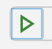

= Test Your Scenarios

Don't forget to test your new Scenario! 

. Remove the `debugger` from your navigation step
. Ensure the scenario has the `@runThis` tag
. Open the `Debug` screen on the left of Visual Studio Code by clicking on the Debug icon on the left. 
. Click on the `Play` button at the top of the `Debug` screen to run your test.
. Ensure your test passes.

It's also worth checking that your test will fail:

. Change the test data so it's incorrect.
. Run the test again and ensure it fails.
. Undo your changes.

Now run the full end-to-end test suite to ensure you haven't broken any other tests:

. Remove the `@runThis` tag from your scenario.
. In the Terminal run the following command:
+
 npm run e2e
+
. This will run headlessly (i.e. you won't see Chome open on the screen). The Terminal will report if the tests passed or failed.

NOTE: Chrome may crash, if this is the case, re-run the command.
